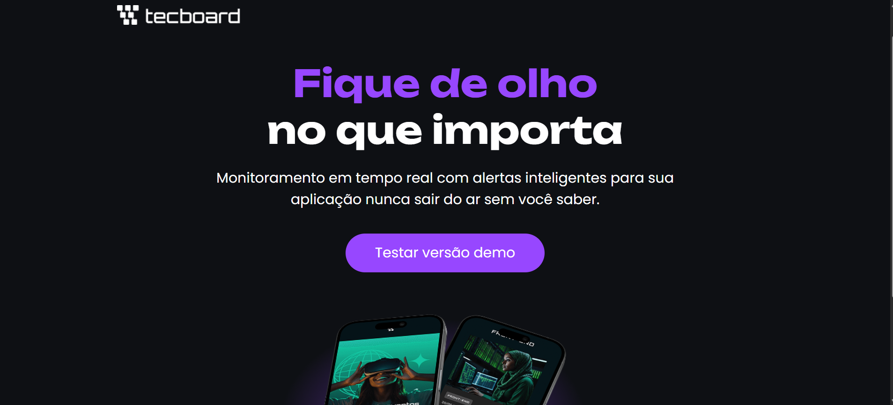

# 🚀 Tecboard

Landing page moderna para apresentação de uma solução de monitoramento em tempo real de aplicações, com foco em performance, disponibilidade e alertas inteligentes.

🔗 **Acesse o projeto online:**
👉 https://diegoandradelr.github.io/tecboard/

---

## 📸 Preview



---

## 🧠 Sobre o projeto

O **Tecboard** é uma interface web desenvolvida com o objetivo de simular a apresentação de uma ferramenta de monitoramento de sistemas, destacando:

- Monitoramento em tempo real
- Alertas inteligentes
- Interface moderna e responsiva
- Foco em experiência do usuário (UX)

O projeto foi construído com **HTML e CSS puro**, reforçando fundamentos essenciais de desenvolvimento front-end.

📚 Este projeto foi desenvolvido como parte do curso **HTML e CSS: Ambiente, Estrutura e Estilo** da Alura.

💡 Projeto desenvolvido para fins educacionais e prática de fundamentos de front-end.

---

## 🛠️ Tecnologias utilizadas

- HTML5
- CSS3
- Media Queries (responsividade)
- `@font-face` para tipografia customizada

---

## 📱 Responsividade

O layout foi adaptado para diferentes tamanhos de tela:

- 💻 Desktop
- 📱 Tablet
- 📱 Mobile (até 395px)

---

## 📂 Estrutura do projeto

```bash
tecboard/
│
├── index.html
├── css/
│   └── style.css
├── img/
├── fonts/
└── README.md
```

---

## 🎯 Objetivo

Este projeto foi desenvolvido com foco em:

- Praticar HTML e CSS
- Trabalhar responsividade
- Criar um layout moderno estilo landing page
- Construir portfólio para oportunidades na área de tecnologia

---

## ⚙️ Como executar localmente

```bash
# Clone o repositório
git clone https://github.com/diegoandradelr/tecboard.git

# Acesse a pasta
cd tecboard

# Abra o index.html no navegador
```

---

## 📌 Melhorias futuras

- [ ] Adicionar interatividade com JavaScript
- [ ] Criar versão com backend (API de monitoramento)
- [ ] Melhorar acessibilidade (a11y)
- [ ] Implementar animações

---

## 👨‍💻 Autor

**Diego Andrade**
📍 Recife - PE
🔗 https://linkedin.com/in/diegoandradelr

---

## 📄 Licença

Este projeto é de uso livre para fins de estudo e portfólio.
